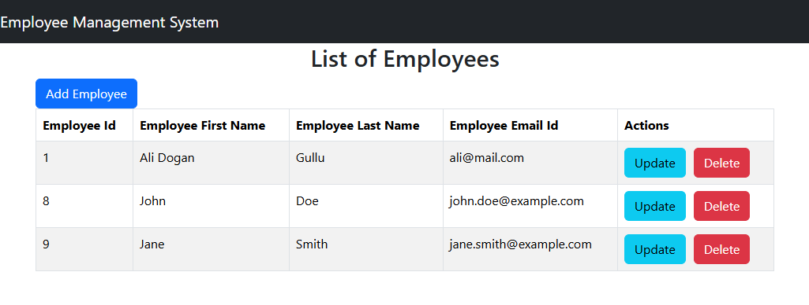
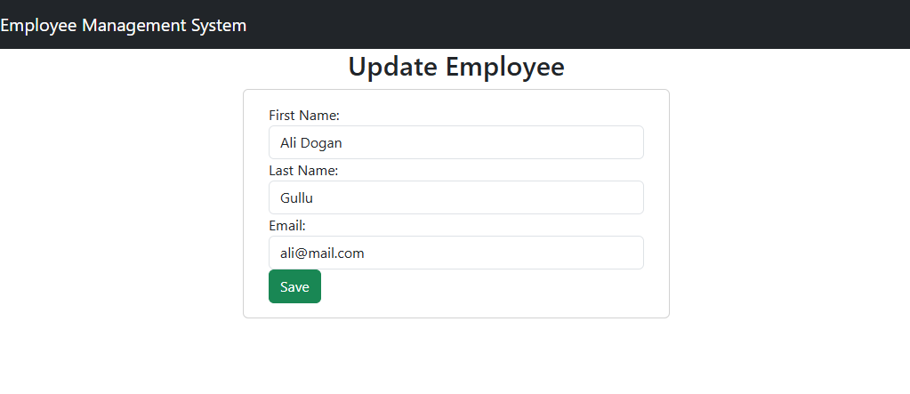

# Employee Management System Demo

This repository contains the code for an Employee Management System developed using **React** for the frontend, **Spring Boot** for the backend, and **MySQL** as the database. The project was created for practice and apply programming concepts and tools taught in the course: [Course Link](https://www.youtube.com/playlist?list=PLGRDMO4rOGcNLnW1L2vgsExTBg-VPoZHr).

## Technologies Used

- **React**: Frontend framework for building user interfaces.
- **Spring Boot**: Backend framework for creating RESTful APIs.
- **MySQL**: Relational database for data storage.

## Screenshots

